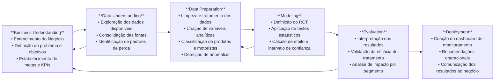
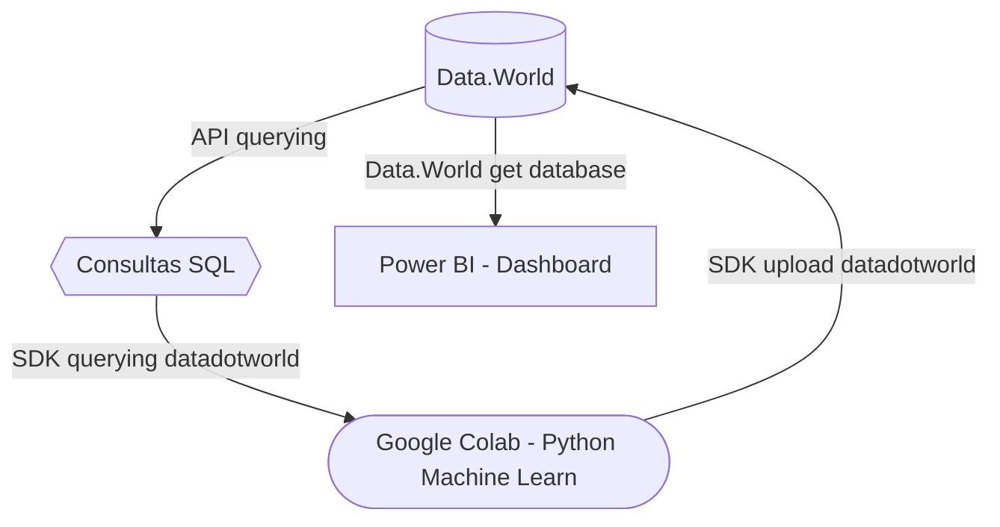

# 🛒 Walmart: Análise de Fraudes e Soluções

Este projeto analisa ocorrências de fraudes no sistema de delivery do e-commerce do Walmart na Flórida Central (EUA), com foco em perdas relatadas por consumidores. A partir da análise exploratória e modelagem de dados, são propostas soluções orientadas a dados para mitigação do problema, com validação por meio de experimentação (RCT).

## 🎯 Objetivos

- Analisar as ocorrências de não recebimento de produtos em entregas relatadas por consumidores.
- Avaliar possíveis causas associadas às perdas, como falhas operacionais, fraudes ou brechas de segurança.
- Identificar padrões nos dados que indiquem irregularidades.
- Verificar a existência de perfis recorrentes de perdas entre motoristas e consumidores.
- Propor recomendações estruturadas com base em evidências estatísticas.
- Planejar e validar soluções por meio de testes experimentais (RCT).

## 🧭 Metodologia

A metodologia adotada neste projeto segue o modelo CRISP-DM (Cross Industry Standard Process for Data Mining), amplamente utilizado em projetos de ciência de dados. Esse framework orienta o desenvolvimento de soluções analíticas de forma cíclica e iterativa, passando por seis fases principais: Entendimento do Negócio, Entendimento dos Dados, Preparação dos Dados, Modelagem, Avaliação e Deploy. Cada fase foi adaptada à realidade do problema analisado, garantindo uma abordagem estruturada e prática para a geração de insights e validação das soluções propostas.

## 🧪 Técnicas Aplicadas

1. **Analise Descritiva**
      - Estatística descritiva e medidas de dispersão
      - Análise temporal e segmentações
2. **Aprendizado não supervisionado**
      - Detecção de anomalias: Isolation Forest
      - Clusterização: Kmeans
3. **Engenharia de Atributos**
      - Criação de métrica multidimensional de risco e vulnerabilidade
4. **Testes Estatísticos**
      - Teste de variância: Levene
      - Correlações e associações: Pearson, ANOVA, t de Student, Mann-Whitney U, Qui-quadrado
      - Cálculo de tamanho de amostra (Sample Size Calculator)
      - Teste de tamanho de efeito: Cohen’s d, Cliff’s delta
      - Análise de co-ocorrência
## 📊 Avaliação de Modelos Não Supervisionados
Como os algoritmos aplicados não utilizam rótulos (labels), foram adotadas métricas específicas para validação em contextos de aprendizado não supervisionado:

- **Clusterização (KMeans)**
A avaliação da segmentação de produtos por risco foi feita com múltiplas métricas internas e externas, como *Silhouette Score, Calinski-Harabasz Index, Davies-Bouldin*. Também foram utilizados plots de dispersão com *PCA (2D)* e* t-SNE (3D)* para inspecionar visualmente a coerência dos agrupamentos formados.

- **Detecção de Anomalias (Isolation Forest)**
A validação da separação entre casos regulares e outliers foi realizada com a projeção dos dados em *UMAP*, permitindo observar se os outliers formavam um grupo realmente distinto no espaço vetorial. A importância dos atributos foi interpretada com SHAP values, possibilitando entender os critérios de decisão do modelo. Por fim, foram utilizados *boxplots comparativos* para *analisar as diferenças* nos atributos mais relevantes *entre o grupo de outliers e os demais*, reforçando a consistência estatística da segmentação.

Essa abordagem multidimensional, ainda que sem rótulos explícitos, permite uma avaliação robusta da qualidade dos modelos, contribuindo para a confiabilidade das recomendações geradas e abrindo caminho para futuras automatizações com maior segurança operacional.

## 🗂️ Etapas

1. **Entendimento do Modelo de Negócio**
      - Sistema de delivery com motoristas independentes.
      - Métodos de entrega e confirmação de entrega.
      - Políticas e horários estabelecidos para as entregas.
2. **Analise Exploratória de Dados**
      - Análise das regiões e períodos que ocorreram as perdas.
      - Análise das perdas por categoria de produtos.
      - Avaliação do impacto financeiro por região e categoria de produto.
      - Verificação da conformidade das entregas com as políticas da empresa.
      - Busca por duplos perfis (possibilidade de fraude)
3. **Detecção de Anomalias**
      - Busca por motoristas e clientes com padrões anômalos de perda e prejuízo (outliers).
      - Comparação entre outliers e os demais.
      - Investigação de co-ocorrência de outliers (motoristas e clientes) em multiplos pedidos.
4. **Recomendação e medidas preventivas**
      - Classificação dos produtos por vulnerabilidade (frequência de perda e impacto financeiro)
      - Classificação de risco por motorista (frequência de perda, valor médio por perda e conformidade nas entregas)
      - Elaboração do sistema de elegibilidade de entregas (alocação estratégica de motoristas a produtos)
5. **Validação da proposta**
      - Elaboração de experimento RCT
      - Planejamento de teste 
      - Simulação da coleta de amostra com dados sintéticos e resumo de resultados

## 🛠️ Tecnologias Utilizadas

- **Análise**:
      - Python (Google Colab, Datadotworld, Pandas, Numpy, StatsModel, SciPy, Shap, Plotly, Networkx, PyCaret)
      - Google Sheets (XLMiner Analisys Toolpack)
- **Banco de Dados**: 
      - Data.World (SQL)
- **Visualização e Monitoramento**: 
      - Power BI (DAX)
- **Documentação e Apresentação**: 
      - Google Docs, Canva

## 📦 Entregáveis

🔗

🔗

🔗

## 🔁 Arquitetura e Fluxo de Dados

O projeto foi hospedado no Data.World, com estrutura que garante reprodutibilidade e atualização contínua. Os notebooks em Python e dashboards no Power BI estão conectados diretamente ao banco de dados.

- Acesso direto aos dados por usuários autorizados
- Atualizações automáticas conforme novos dados são inseridos
- Centralização dos dados, evitando redundância local

Essa arquitetura garante rastreabilidade, escalabilidade e facilidade de manutenção, contribuindo para a confiabilidade e a continuidade das análises.

## 🧰 Recursos

As tabelas do banco de dados e as consultas SQL podem ser acessadas diretamente no repositório do projeto na plataforma Data.World: 

🔗 

| Tipo                  | Nome                                             | Descrição                                                                                           | Plataforma / Ferramenta |
|-----------------------|--------------------------------------------------|-----------------------------------------------------------------------------------------------------|--------------------------|
| **📁 Banco de Dados**  | `customers_data.csv`                             | Cadastro dos clientes.                                                                              | Data.World               |
|                       | `drivers_data.csv`                               | Cadastro dos motoristas.                                                                            | Data.World               |
|                       | `missing_items_data.csv`                         | Registro dos itens perdidos.                                                                        | Data.World               |
|                       | `orders.csv`                                     | Registro dos pedidos.                                                                               | Data.World               |
|                       | `products_data.csv`                              | Cadastro dos produtos.                                                                              | Data.World               |
| **🧮 Consultas SQL**   | `orders_agregated`                               | Agrega dados de perdas e produtos (usado no experimento RCT).                                       | Data.World               |
|                       | `products_data_treated`                          | Corrige rótulos de categorias.                                                                      | Data.World               |
|                       | `products_summary`                               | Total de perdas e prejuízo por produto (usado para clusterização).                                  | Data.World               |
|                       | `drivers_summary`                                | Consolida as informações por motorista (usado para detecção de anomalias).                          | Data.World               |
|                       | `customers_summary`                              | Consolida as informações por cliente (usado para detecção de anomalias).                            | Data.World               |
|                       | `cross_anomaly_detection`                        | Reúne informações de clientes e motoristas com rótulos de anomalia (análise de co-ocorrência).     | Data.World               |
| **📓 Notebooks**       | [`Walmart_Products_Cluster_Labels.ipynb` ](https://colab.research.google.com/drive/1JDtmyVb76Y97C43zEUq3lsxP_OYNcTIF?usp=sharing)| Classifica produtos por vulnerabilidade e valor (KMeans).                                           | Google Colab             |
|                       | [`Walmart_Drivers_Anomaly_Detect.ipynb`](https://colab.research.google.com/drive/1BVIFUWmIjJNEcQriI-xCciMnMOI2A4tb?usp=sharing)| Identifica motoristas com padrões anômalos (Isolation Forest).                                      | Google Colab             |
|                       | [`Walmart_Customers_Anomaly_Detect.ipynb`](https://colab.research.google.com/drive/1wq6j7oIK6FNkIdcoIRZga9ologG1K3Z2?usp=sharing)| Identifica clientes com padrões anômalos (Isolation Forest).                                        | Google Colab             |
|                       | [`Walmart_Cross_Anomaly_Detect.ipynb`](https://colab.research.google.com/drive/1PChDSHYS_P4zdBjvoRmtCzRI08WoFdNz?usp=sharing)| Verifica co-ocorrência de motoristas/clientes anômalos e testa correlação/associação.              | Google Colab             |
|                       | [`Walmart_RCT_Orders.ipynb`](https://colab.research.google.com/drive/1UA1MV7a3JfrHciMYSh4kR4zR6y0Hwqbx?usp=sharing)| Planeja experimento RCT: cálculo amostral, hipóteses, rigor estatístico.                            | Google Colab             |
| **📊 Análises Ad Hoc** | [`Walmart_ANOVA`](https://docs.google.com/spreadsheets/d/1jyPHfTt6vIw-Gbyy40gHEwGYfMfCRv7IQsXW9xY9O-k/edit?usp=sharing)| Teste ANOVA para validar segmentações de produtos e motoristas.                                     | Google Sheets            |
| **📈 Dashboards**      | [`Dashboard`](https://app.powerbi.com/view?r=eyJrIjoiNTQyYzg2MTgtYWNlZi00ZGY0LThkOGItZGFlODJiYzU1ZTU1IiwidCI6IjQ3MzViMTc4LTMxNWUtNDhjMC04MTExLTY5YzgxNjkyODllZiJ9&pageName=bee5e6cadeb810464770)| Painel com KPIs e desempenho geral do e-commerce.                                                   | Power BI                 |
|                       | `Driver_Risk_Score`                              | Score de risco com base em perdas médias, prejuízo e atrasos.                                       | Power BI                 |
|                       | `Driver_Risk_Label`                              | Classificação dos motoristas em níveis de risco com base no score.                                  | Power BI                 |

## 📃 Licença

Este projeto é licenciado sob a licença [MIT License](LICENSE), permitindo uso, modificação e distribuição livre do código e das análises desenvolvidas.

**Atenção:** Os arquivos de dados brutos *orders.csv*, *products_data.csv*, *missing_items_data.csv*, *customers_data.csv*, *drivers_data.csv*, hospedados em [Walmart Fraud Detect](https://data.world/pedrokaneko/walmartfrauddetect), foram disponibilizados por [DataTech Florida](https://www.datatechflorida.com/), que detém os direitos autorais sobre eles.

Esses dados são fornecidos exclusivamente para fins educacionais e **não podem ser reutilizados, redistribuídos ou comercializados** sem autorização expressa.

Para mais informações sobre o uso dos dados, consulte a [Política de Uso de Dados](DATA_LICENSE.md).
